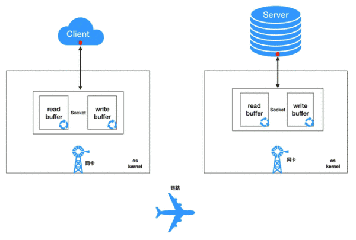

# Web Communication

## Socket

### **What** is Socket?

socket 是进程通信的机制(套接字是对TCP/IP协议的封装)，用于描述IP地址和端口，是一个通信链的句柄（其实是程序间通信用的）， 源于Unix， 所有的文件都是 open - read/write - close 模式。
  
*socket读写细节*  
自身并非协议而是一套调用的接口规范， 以下*前两种*通信方式收发消息都依靠它(例如web服务器底层依赖它、关系型*数据库MySQL*~(就从这里下手了)~底层依赖它、微信即时通信依赖它、网络游戏依赖它...):

1. TCP/IP
  传输控制协议/网间协议（Transmission Control Protocol/Internet Protocol）是一个工业标准的协议集，是为广域网WAN而设计的。  
  通过**客户端**和**服务端**的点对点连接， 降低了数据传输时的==丢包率== ~(丢包率是什么?~~有什么用~~如怎么判断)~
2. UDP
  用户数据报协议（User Data Protocol）是与TCP相对应的协议，属于TCP/IP协议簇中的一员。  
  客户端和服务端之间是点对多的连接~(前后关系是不是反过来也没有问题?)~， 保证了连接效率， 但是丢包率会增加
3. HTTP
  超文本传输协议（Hypertext Transfer Protocol）是互联网的基础，也是手机网络协议之一，HTTP协议是建立在TCP协议之上的一种应用。  

- Socket 长连接
  短连接一般都是单项请求数据，服务端不能主动将数据推送给客户端，而长连接即可利用后端与前端的技术结合，实现服务端的推送功能，若数据库有更新，后端程序即可立即将数据推送出来，无需多次反复请求、建立连接、断开连接。  

  长连接实质是指建立socket套接字连接后不断是否适用都保持连接，其安全性较差。而短连接指的是建立socket套接字连接后发送接收数据后马上断开连接。  

  长连接在基于TCP的通讯中，一直保持连接，不管当前是否发送或接收数据。而短连接只是在有数据传输的时候才进行连接，服务端和客户端通信与传输数据完毕后就关闭连接，例如在HTTP、CMPP等。

### **Why** use Socket? 有其他的代替的东西嘛?

因为这是一种客户端与服务端沟通，交互的一种方式

### **How** use Socket?

### Topic

C10K 问题

### DataBase（MySQL云服务器）

- 部署MySQL

1. 选择一个目录进入（准备安装MySQL）  
  `cd /usr/local/src/` 这里选择src目录  
2. 下载安装包命令  
  `wget http://repo.mysql.com/mysql57-community-release-el7-8.noarch.rpm`  
3. 安装命令
  `rpm -ivh mysql57-community-release-el7-8.noarch.rpm`  
4. 安装MySQL服务器  
  ubuntu需要安装yum
  ~~a. 输入以下命令备份一下你的Ubuntu默认的源地址。  
  `sudo cp /etc/apt/sources.list /etc/apt/sources.list.backup`  
  b. 再输入命令修改Ubuntu的源地址。  
  `sudo edit /etc/apt/sources.list`(提示command not found)  
  c. 再输入命令更新一下。  
  `sudo apt-get update`  
  d. 最后输入命令安装yum即可。  
  `sudo apt-get install yum`（E: Unable to locate package yum）~~  
  `yum -y install mysql-server`  
5. 安装完成后启动服务
  `service mysqld restart`  
6. 获取MySQL初始密码
  `grep "password" /var/log/mysqld.log`
7. 使用密码登录数据库
  `mysql -u root -p`
8. 设置root用户在本机登陆  
  `alter user 'root'@'localhost' identified by 'selfpassword'`
9. 设置root用户在任何IP都可以登录
  `create user 'root'@'%' identified by 'selfpassword'`
10. 设置数据库的登录权限(在任何IP下通过root用户都可以访问数据库)
  `grant all privileges on *.* to 'root'@'%' with grant option`
11. 刷新设置的权限
  `flush privileges`
12. 退出数据库
  `exit`，不知道`Ctrl C`可不可以
13. 端口设置（应该是用于访问）
  添加端口  
  `firewall-cmd --zone=public --add-port=3306/tcp --permanent`  
  查询端口列表  
  `firewall-cmd --list-port`  
  重启防火墙(应该是添加完之后需要重启，和权限道理一样ig)  
  `firewall-cmd --reload`  
14. 云服务器中控制台的安全策略/组同样需要添加这个端口  
